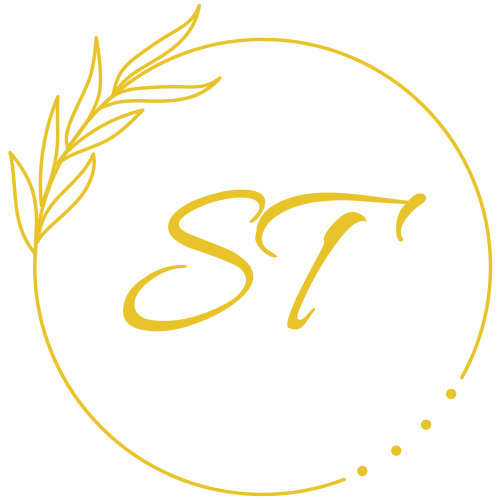
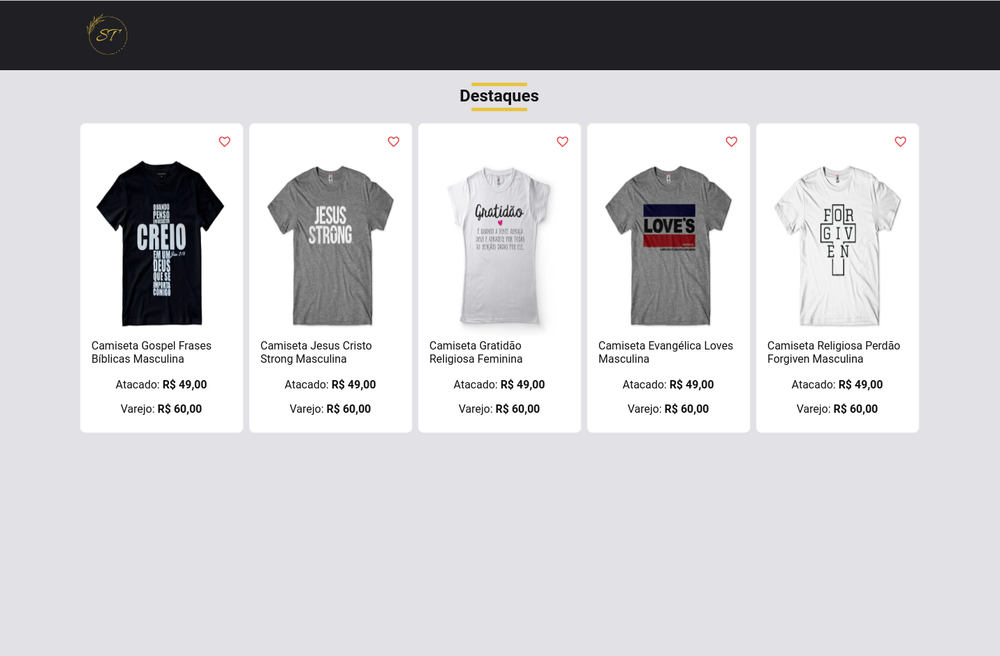

<h1 align="center">
  
</h1>

  <a href="#-tecnologias">Tecnologias</a>&nbsp;&nbsp;&nbsp;|&nbsp;&nbsp;&nbsp;
  <a href="#-projeto">Projeto</a>&nbsp;&nbsp;&nbsp;|&nbsp;&nbsp;&nbsp;
  <a href="#-como-executar">Como executar</a>&nbsp;&nbsp;&nbsp;|&nbsp;&nbsp;&nbsp;
  <a href="#-layout">Layout</a>&nbsp;&nbsp;&nbsp;|&nbsp;&nbsp;&nbsp;
  <a href="#memo-licença">Licença</a>

 

  

 

  

## 🚀 Tecnologias

Esse projeto foi desenvolvido com as seguintes tecnologias:

- [HTML](https://developer.mozilla.org/pt-BR/docs/Web/HTML)
- [SASS](https://sass-lang.com/)
- [TypeScript](https://www.typescriptlang.org/)
- [React Testing Library](https://testing-library.com/docs/react-testing-library/intro/)
- [NEXT.js](https://nextjs.org/)

## 💻 Projeto

Esse projeto é uma landpage, responsiva, perfeita para exibir produtos que inspiram.

## 🚀 Como executar

Para iniciar o seu servidor NEXT.js:

- Instale as dependências com `yarn`
- Inicie a API fake `yarn server`
- Inicie o servidor NEXT.js com `yarn dev`

Agora você pode acessar [`localhost:3000`](http://localhost:3000) do seu navegador.

<!-- ## 🔖 Layout

Você pode visualizar o layout do projeto através [desse link](). É necessário ter conta no [Figma](https://figma.com) para acessá-lo. -->

## 📝 Licença

Esse projeto está sob a licença MIT. Veja o arquivo [LICENSE](LICENSE) para mais detalhes.

---

Feito com 💜 by Anderson Nascimento :wave: [Linkedin](https://www.linkedin.com/in/andersonnascimentoafsn/)
